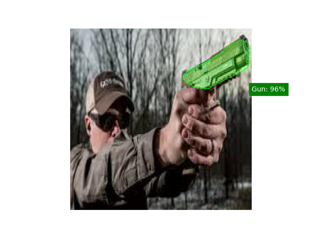

# CUSTOM U-NET FOR WEAPON DETECTION

## Description

This project is based on creating a network for gun segmentation in images. To accomplish this, a version of U-net is 
developed, where the encoding part will be a ResNet18 with ImageNet weights. For the decoding part, information from 
this network will be leveraged, and using an inversion strategy, the architecture will be replicated, with weights 
initialized by reversing their order.

## Getting Started

### Dependencies

* Operating System: Windows 10 Home 64-bit - version 21H2.
* Programming Language: Python 3.11.
* IDE: PyCharm Professional 2023.2
* Libraries:
  * Torch v2.1.0
  * Torchvision v0.16.0
  * Matplotlib v3.8.0
  * Numpy v1.25.1
  * OpenCV v4.8.1.78
  * Json v0.9.14
  * Pillow 9.3.0
  * Torchsummary 1.5.1
  * Skimage 0.22.0

## Author
Roi Rodríguez

## Data

This project uses g Computer Vision Project downloaded from [Roboflow](https://universe.roboflow.com) 

[Generated on Sep 17, 2023](https://universe.roboflow.com/python-stuff-pi0lj/g-lbfnm/dataset/2)

## Results
* The creation of the U-net and how the weights are initialized can be found in [U_net.py](U_net.py)
* The creation of the Dataset can be found in [Tools.py](Tools.py)
* The results can be found in [train_unet.ipynb](train_unet.ipynb)

